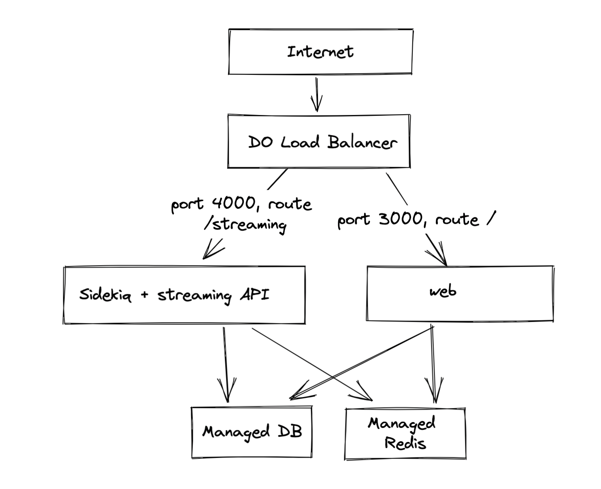

# toot.pizza via Digital Ocean App Platform
This folder contains files that define the deployment of [toot.pizza](https://toot.pizza) on the [Digital Ocean App Platform](https://www.digitalocean.com/products/app-platform).

## Architecture overview
Here's a very basic diagram of how this works:

## app.yaml
This is the [app specification](https://docs.digitalocean.com/products/app-platform/reference/app-spec/). It's basically the full definition of the app. When modifying the app in the DO console, it may likely change the app spec, so it must be updated here as well to prevent config drift. You can access the current app spec on the app's settings page.

## db-cert.crt
Digital Ocean's managed Postgres product publishes this certificate to be used when communicating via SSL with the database. It is not a default trusted certificate. Rails does not check that this certificate is trusted when making queries, but Node does, so the streaming API fails without it, throwing an "untrusted certificate" error on every request.

I fixed this by adding this cert to the container and setting the [`NODE_EXTRA_CA_CERTS`](https://nodejs.org/api/cli.html#node_extra_ca_certsfile) environment variable. This tells Node to trust the cert.

## Dockerfile.web
This builds a container that runs the Mastodon Rails server. Easy peasy.

## Dockerfile.workers
This builds a container that uses [Overmind](https://github.com/DarthSim/overmind) to run both Sidekiq and the streaming API. These are grouped together to optimize for RAM utilization. Web takes up about 60% of its container's RAM on its own but Sidekiq + streaming API take up 60% or so together.

## Procfile.workers
This tells Overmind how to run Sidekiq + the streaming API.
